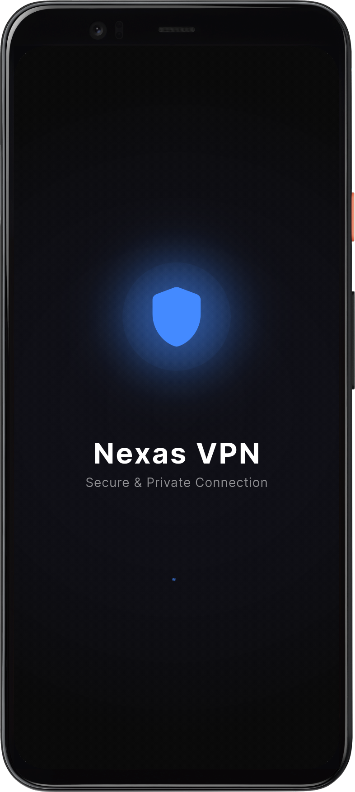
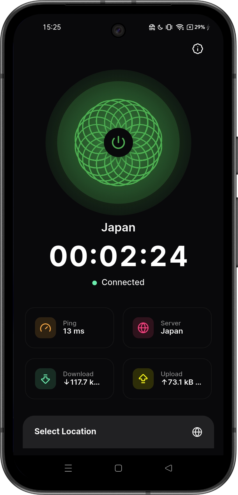
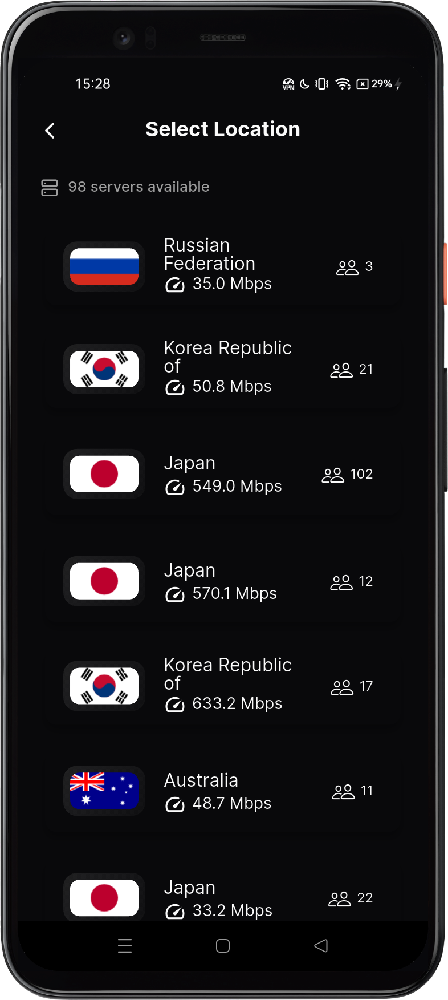
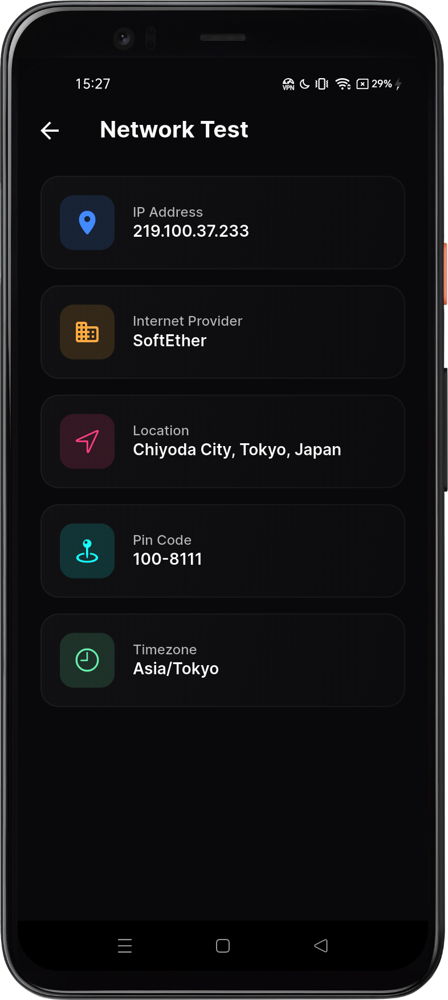

# Nexas VPN


A modern, secure, and beautifully designed VPN application built with Flutter.

## Features

- **Secure VPN Connection** - OpenVPN protocol support
- **Multiple Server Locations** - Connect to servers worldwide
- **Network Details** - View your IP, ISP, location, and more
- **Modern UI** - Beautiful dark theme with smooth animations
- **Fast & Reliable** - Optimized for performance
- **Cross-Platform** - Built with Flutter for Android

## Screenshots

| Splash Screen                                   | Home Screen                                 | Server Selection                                            | Network Details                                        |
| ----------------------------------------------- | ------------------------------------------- | ----------------------------------------------------------- | ------------------------------------------------------ |
|  |  |  |  |

## Getting Started

### Prerequisites

- Flutter SDK (3.24.5 or higher)
- Dart SDK
- Android Studio / VS Code
- Java 17

### Installation

1. Clone the repository:

```bash
git clone https://github.com/shutterscripter/texas_vpn.git
cd texas_vpn
```

2. Install dependencies:

```bash
flutter pub get
```

3. Run the app:

```bash
flutter run
```

### Building for Production

**Android APK:**

```bash
flutter build apk --release
```

**Android App Bundle:**

```bash
flutter build appbundle --release
```

## CI/CD

The CI pipeline runs automatically on:

- Push to `main` branch
- Pull requests to `main` branch

## Project Structure

```
lib/
├── api/              # API services and network calls
├── constants/        # App constants and configurations
├── controllers/      # GetX controllers for state management
├── helpers/          # Helper utilities and functions
├── models/           # Data models
├── screens/          # UI screens
├── services/         # Business logic services
└── widget/           # Reusable widgets
```
